# Сдача проектной работы 9 спринта

## Задание 1. Повышение безопасности системы

### Задача 1,2,3,4,5

Для запуска необходимо указать в `.env` файле
```
KEYCLOAK_URL=http://{ip_хоста}:8080
```
И запустить
```
docker compose -f docker-compose1.yaml up -d
```

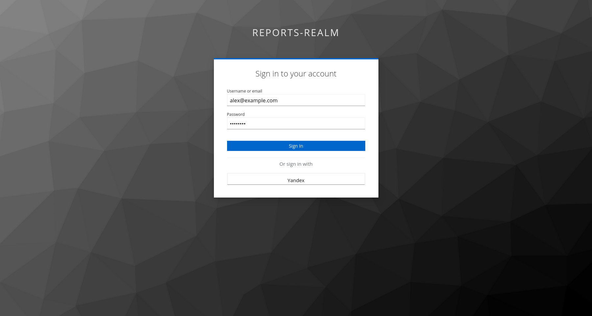
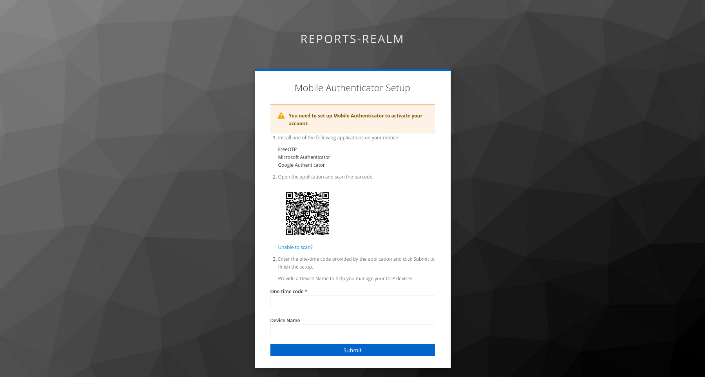


### Задача 6
Для запуска необходимо указать в `.env` файле 
```
KEYCLOAK_URL=http://{публичный_ip_хоста}:8080
AUTH_URL=http://{публичный_ip_хоста}:8000
FRONTEND_URL=http://{публичный_ip_хоста}:3000
```
В `keycloak/.env`
```
YANDEX_CLIENT_ID=
YANDEX_CLIENT_SECRET=
```
И запустить
```
docker compose -f docker-compose1.yaml up -d
```

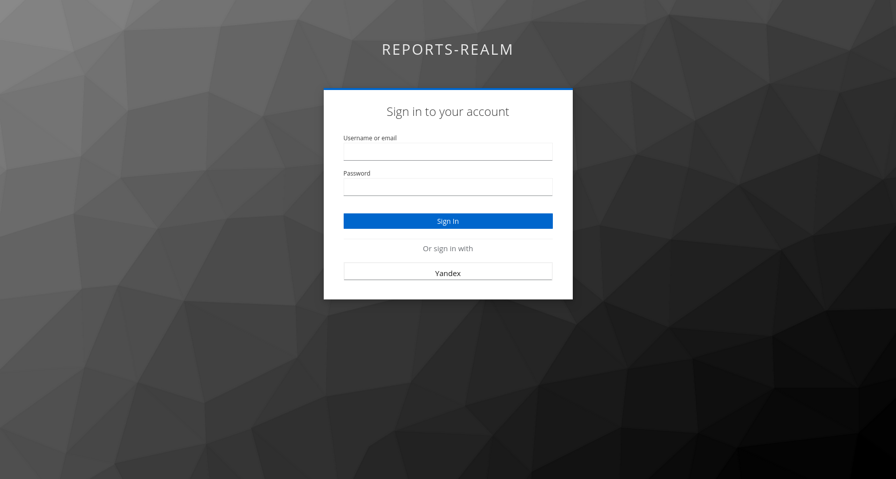

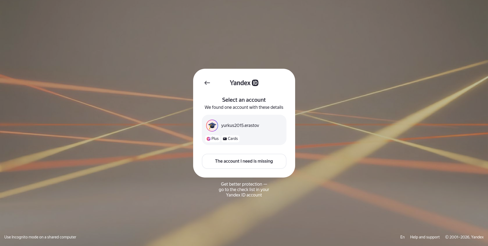


## Задание 2. Разработка сервиса отчётов


Для запуска необходимо указать в `.env` файле
```
KEYCLOAK_URL=http://{ip_хоста}:8080
```
И запустить
```
docker compose -f docker-compose2.yaml up -d
docker compose -f airflow-docker-compose.yaml up -d
```

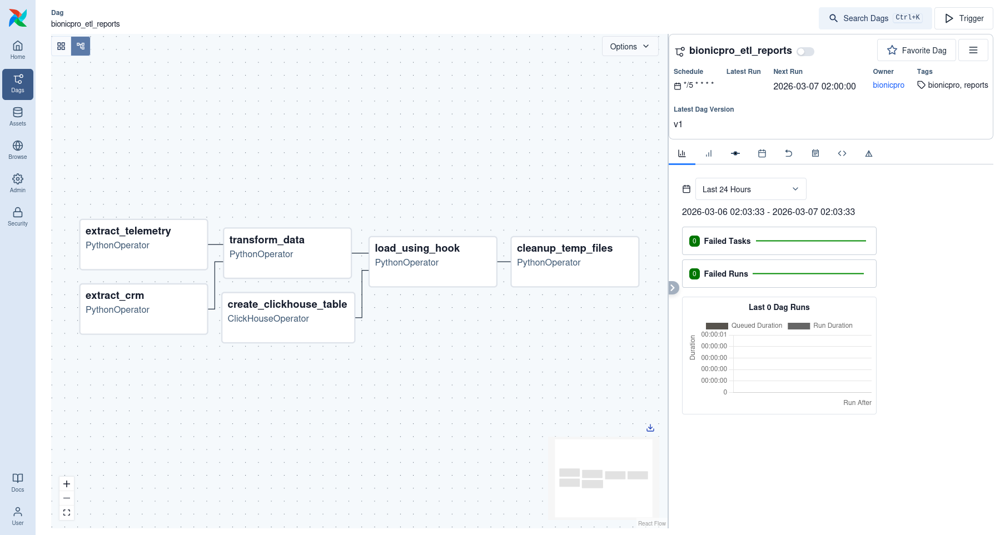
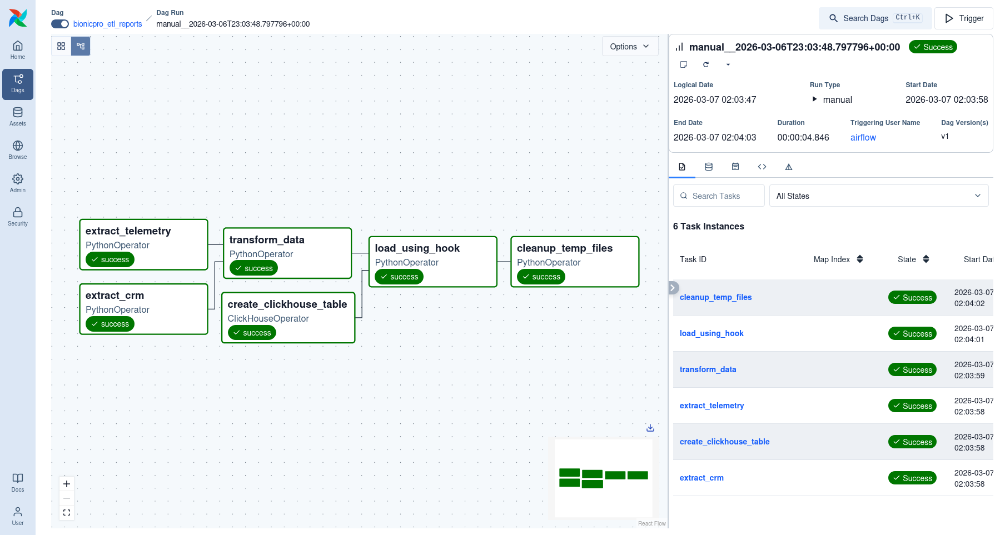
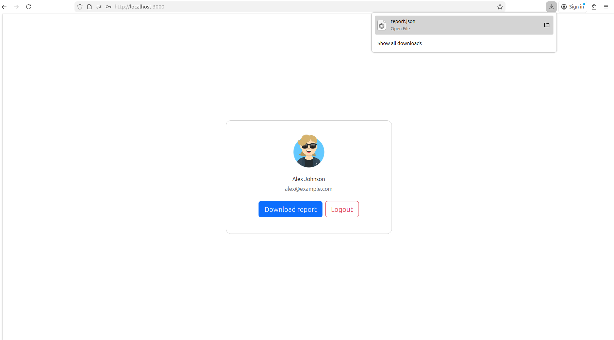
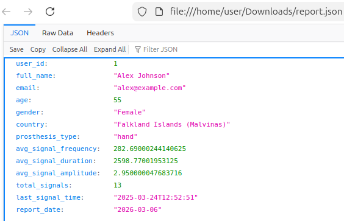


## Задание 3. Снижение нагрузки на базу данных

Для запуска необходимо указать в `.env` файле
```
KEYCLOAK_URL=http://{ip_хоста}:8080
```
И запустить
```
docker compose -f docker-compose3.yaml up -d
docker compose -f airflow-docker-compose.yaml up -d
```
На логах видно что кеш инвалидируется при создании новой ссылки по timestamp ETL-процесса

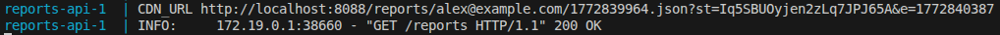
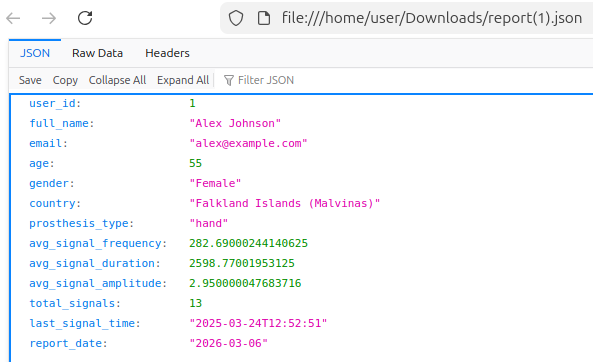
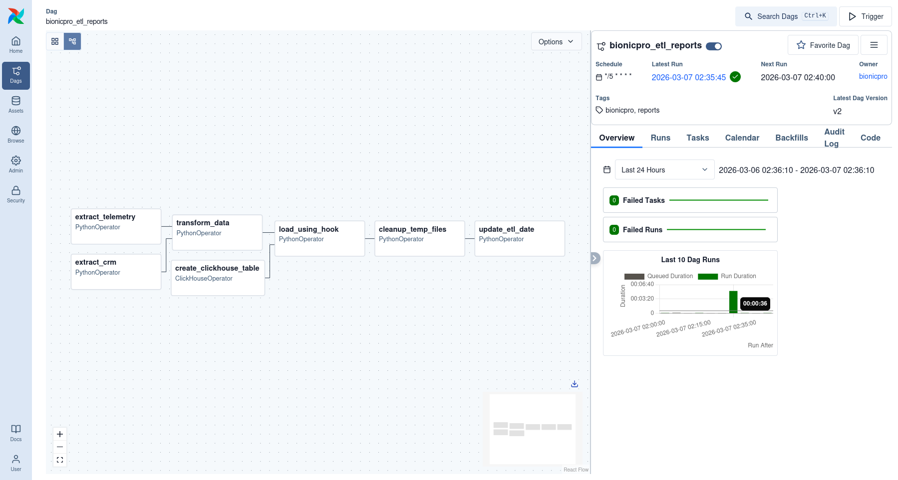
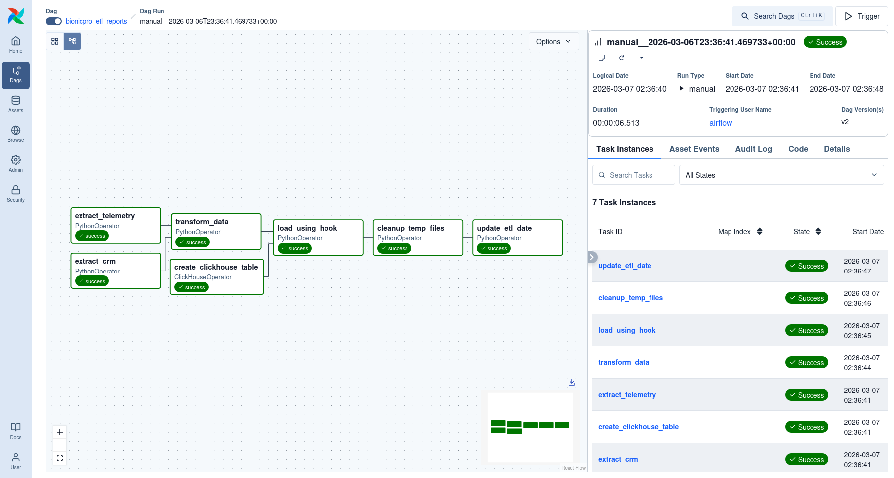
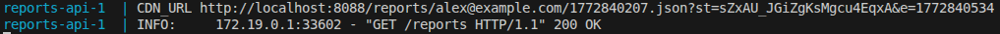

## Задание 4. Повышение оперативности и стабильности работы CRM

Для запуска необходимо указать в `.env` файле
```
KEYCLOAK_URL=http://{ip_хоста}:8080
```
И запустить
```
docker compose -f docker-compose.yaml up -d
docker compose -f airflow-docker-compose.yaml up -d
```

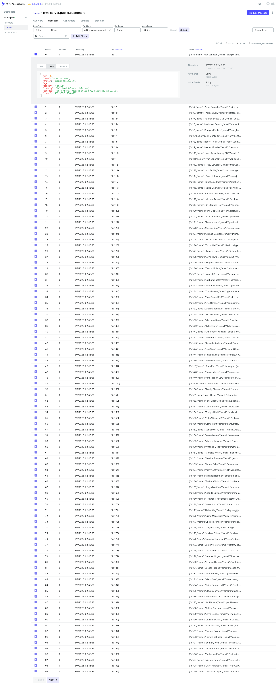
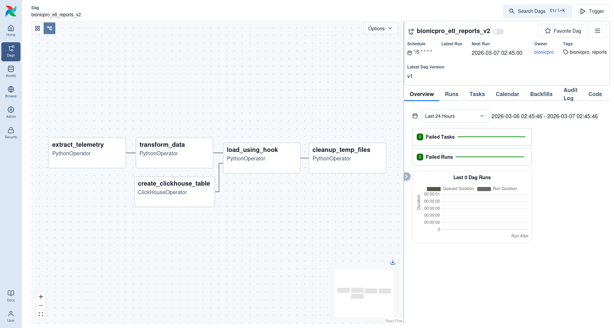
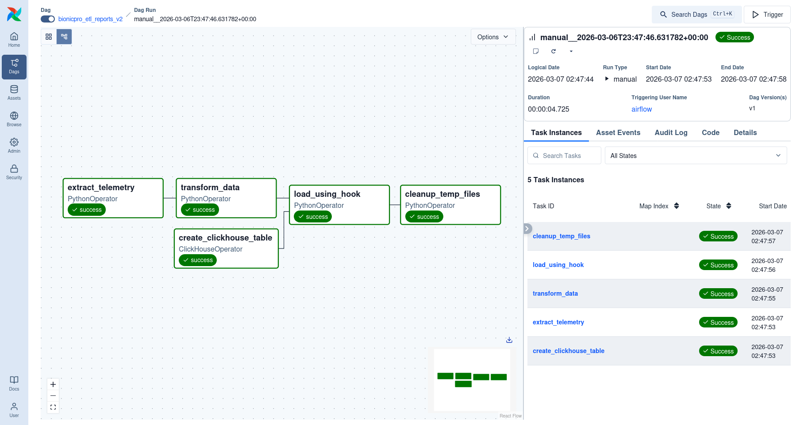
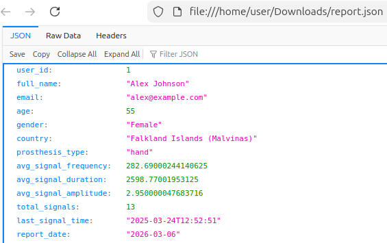